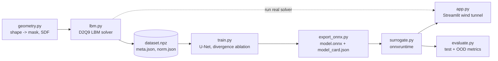

# Interactive Wind Tunnel

**A neural surrogate for steady 2D flow past a shape, presented as an interactive virtual wind tunnel.**

Pick a shape (circle, ellipse, rotated rectangle), set its size, angle and Reynolds number, and a
trained U-Net predicts the full flow field (velocity `u`, `v` and pressure `p`) in milliseconds, without
running the solver. From the predicted field the app reports drag and lift
coefficients, peak stagnation pressure and wake vorticity, and it can run the real solver on demand to
show **surrogate vs ground truth** side by side.

> **Status: v0.1.** The LBM solver, the Streamlit app, a 50-sample real dataset generator and a tiny MLP
> surrogate (ONNX) are in. The committed MLP was trained on the fake potential-flow data, so its
> predictions are placeholders until it is retrained on the real tiny dataset. See [Project status](#project-status).

---

## What this is, and what it is not

| | |
|---|---|
| **The tunnel** | A *simulated* channel, 128 x 64 lattice cells with solid top and bottom walls. Not a physical tunnel and not open air. |
| **Ground truth** | Our own D2Q9 lattice-Boltzmann (LBM) solver in numpy. The surrogate learns to imitate *that solver*, including its discretisation errors. |
| **Dimensions** | 2D only, a deliberate simplification so the project fits on laptop hardware. |
| **Reynolds number** | 10 to 40 only. Above Re ~47, flow behind a bluff body sheds vortices and never becomes steady, so one shape would no longer have one answer. |
| **Blockage** | Obstacles are 10-16 cells tall in a 62-cell channel (up to ~26% blockage), so drag values are *channel* values, not free-stream values. |
| **Shapes** | Train: circle, ellipse, rotated rectangle. Out-of-distribution test: triangles. NACA airfoils deferred (too thin for this grid). |

## How it works



1. **Data.** `generate.py` rasterises random shapes and runs the LBM solver to steady state. It stores
   inputs (`sdf`, `mask`, `re_norm`) and targets (`u`, `v`, `p`). The split is 80/10/10, stratified by
   (shape kind, Re bucket) and seeded. Triangles are held out as an OOD set.
2. **Model.** A ~1.9M-parameter 2D U-Net maps `[N, 3, 64, 128]` inputs to `[N, 3, 64, 128]` fields.
   The loss is per-channel normalised MSE plus `w * mean(div^2)`, a soft incompressibility prior. The weight
   `w` is chosen by an ablation on the validation set only.
3. **Export.** Normalisation, denormalisation and masking are built into the ONNX graph. The app takes
   **raw** inputs and gets **physical** fields back, with no torch at runtime.
4. **Evaluation.** Relative L2 per channel, pressure drag and lift error (the same surface estimator on
   prediction and ground truth), latency and speed-up, compared against mean-field, nearest-neighbour and
   potential-flow baselines.

## Targets

These are **hypotheses we test, not promises**. We report whatever we measure.

| Metric (in-distribution test set) | Target |
|---|---|
| Relative L2 error on velocity (u, v), fluid cells | < 10% |
| Pressure-drag coefficient error | < 10% |
| Inference per shape, CPU, onnxruntime | < 50 ms |
| Speed-up vs the LBM solver per shape | >= 100x |
| OOD set (triangles) | reported, no target |

The test and OOD sets are never used for training, tuning or model selection. Only `evaluate.py` reads them.

## Project status

| Component | File(s) | Owner | Status |
|---|---|---|---|
| Shared contract | `windtunnel/contract.py` | Aryan | Done |
| Geometry (masks, SDF) | `windtunnel/geometry.py` | Aryan | Done |
| LBM solver | `windtunnel/lbm.py` | Aryan | Done |
| Dataset assembly + generator | `windtunnel/dataset.py`, `scripts/generate.py` | Aryan | Done |
| Metrics, baselines, plots | `windtunnel/metrics.py`, `baselines.py`, `viz.py` | Aryan | Done |
| ONNX loader | `windtunnel/surrogate.py` | Aryan | Done |
| Evaluation | `scripts/evaluate.py` | Aryan | Done |
| Streamlit app | `app/app.py` | Aryan | Done |
| Fake dataset + dummy ONNX model | `scripts/make_fake_dataset.py`, `windtunnel/dummy_model.py` | Aryan | Done |
| Docker images | `Dockerfile`, `compose.yaml` | Aryan / Abhay | Done |
| U-Net + export wrapper | `windtunnel/model.py` | Abhay | Done |
| Training + divergence ablation | `scripts/train.py` | Abhay | Done (verified on fake data) |
| ONNX export + model card | `scripts/export_onnx.py` | Abhay | Done (verified on fake data) |
| Model tests | `tests/test_model.py` | Abhay | Done (5 tests) |
| Geometry (masks, SDF) | `windtunnel/geometry.py` | Aryan | Done |
| LBM solver | `windtunnel/lbm.py` | Aryan | Done (MAX_ITERS 2000 for interactivity) |
| Tiny dataset generator (v0.1) | `scripts/make_tiny_dataset.py` | Amogh | Done (50 converged, meta in `datasets/`) |
| Full dataset generator | `scripts/generate.py` | Aryan | Done, parked for v0.1 |
| Metrics, baselines, plots | `windtunnel/metrics.py`, `baselines.py`, `viz.py` | Aryan | Done |
| ONNX loader | `windtunnel/surrogate.py` | Aryan | Done |
| Evaluation | `scripts/evaluate.py` | Aryan | Done, parked for v0.1 |
| Streamlit app | `app/app.py` | Aryan | Done (LBM solver and neural surrogate modes) |
| Tiny MLP (v0.1) | `scripts/train_mlp.py`, `models/model.onnx` | Abhay | Done, **but trained on fake data**: retrain on `DATA_DIR/tiny` |

## Quick start

Everything runs in Docker. You need Docker Desktop and about 1 GB of disk for the base image (about 2.5 GB
more for the train image).

```bash
git clone https://github.com/Aryan-Pillai7/interactive-wind-tunnel.git
cd interactive-wind-tunnel
cp .env.example .env          # set DATA_DIR to a folder on your machine
```

Datasets, checkpoints and results live in `DATA_DIR` (mounted at `/data` in the containers), never in the repo.

### Base image: solver, data, evaluation, app (no torch)

```bash
docker compose build
docker compose run --rm test                                  # tests
docker compose run --rm --entrypoint python shell scripts/make_fake_dataset.py   # -> DATA_DIR/fake
docker compose run --rm gen                                   # v0.1 tiny dataset -> DATA_DIR/tiny
docker compose run --rm eval --allow-dummy                    # evaluation (parked for v0.1)
docker compose up app                                         # http://localhost:8501
```

### Train image: model training and export (torch + onnx)

v0.1 MLP, local Python (no Docker needed; needs torch, onnx, onnxruntime):

```bash
python scripts/make_fake_dataset.py --out <DATA_DIR>/fake
python scripts/train_mlp.py --data <DATA_DIR>/fake/dataset.npz --out <DATA_DIR>/fake   # pipeline check
python scripts/make_tiny_dataset.py --n 50 --seed 0 --out <DATA_DIR>/tiny                # real 50 samples (LBM)
python scripts/train_mlp.py --data <DATA_DIR>/tiny_dataset.npz                         # copy of tiny/dataset.npz
```

U-Net (full plan), in Docker:

```bash
docker compose --profile train build
docker compose run --rm --entrypoint python train scripts/make_fake_dataset.py
docker compose run --rm train                       # v0.1 MLP on DATA_DIR/tiny -> models/model.onnx + card
docker compose run --rm train --data /data/fake/dataset.npz             # same, on the fake data
docker compose run --rm --entrypoint python train -m pytest -q tests/test_model.py
```

For a CUDA GPU, set `TORCH_INDEX_URL=https://download.pytorch.org/whl/cu126` in `.env` and uncomment
`gpus: all` in `compose.yaml`.

> **Windows notes.** In `.env`, `DATA_DIR=C:/path/with/forward/slashes` is the safest form. In Git Bash,
> prefix docker commands with `MSYS_NO_PATHCONV=1` when passing `/data/...` paths, or use PowerShell.

## The model contract

The handoff between training and the app is one file, `models/model.onnx`:

| | |
|---|---|
| Opset | 17 |
| Input `"inputs"` | float32 `[batch, 3, 64, 128]`: **raw** `sdf`, `mask`, `re_norm` |
| Output `"fields"` | float32 `[batch, 3, 64, 128]`: `u`, `v`, `p` in **physical lattice units**, exactly 0 inside the obstacle |
| Batch axis | dynamic (`"batch"`) |
| Check | torch vs onnxruntime max abs diff < 1e-4 on the validation set |

```python
import onnxruntime as ort
fields = ort.InferenceSession("models/model.onnx").run(["fields"], {"inputs": x})[0]
```

`models/model_card.json`, written next to it, records the parameter count, config, loss, the full
divergence-weight ablation, training time and hardware, validation metrics, the ONNX check and the
exact commands to reproduce.

### Conventions

- Arrays are `[C, H, W] = [C, 64, 128]`. Row 0 is the bottom wall, column 0 is the inlet, and flow goes left
  to right. Plot with `origin="lower"`.
- Lattice units throughout. Inlet `u = U0 = 0.05`, `v = 0`.
- `p = (rho - rho_ref) / 3 / (0.5 * U0^2)`, with `rho_ref` the mean density over the outlet fluid cells.
- `sdf` is positive in the fluid and negative inside the obstacle. `mask` is 1 inside the obstacle.
  `re_norm = (Re - 10) / 30`.
- Every shared constant lives in [`windtunnel/contract.py`](windtunnel/contract.py). Import it, never hard-code it.

## Repository layout

```
windtunnel/
  contract.py        shared constants and conventions (the contract)
  geometry.py        shape rasterisation, signed distance field
  lbm.py             D2Q9 lattice-Boltzmann solver (ground truth)
  metrics.py         relative L2, divergence, vorticity, drag/lift, stagnation pressure
  baselines.py       mean field, nearest neighbour, potential flow
  model.py           U-Net, tiny MLP, Exported (ONNX contract wrapper)
  surrogate.py       onnxruntime loader used by the app and evaluation
  viz.py             plotting helpers
  dummy_model.py     reference model with the exact ONNX I/O
scripts/
  make_fake_dataset.py   small fake dataset with the real schema
  generate.py            full dataset generation with the solver
  train.py               U-Net training + divergence-weight ablation
  train_mlp.py           v0.1 tiny MLP: train, export, check, model card
  export_onnx.py         ONNX export, torch-vs-ONNX check, model card
  evaluate.py            test + OOD evaluation, baselines, latency
app/app.py           Streamlit virtual wind tunnel
tests/               pytest suite
models/              model.onnx + model_card.json (the only committed artefacts)
```

## Contributing

- **Ownership.** Aryan owns the solver, data, metrics, evaluation and app side. The model side (model,
  training, export) is described in [ABHAY.md](ABHAY.md), with the current handoff in [AMOGH.md](AMOGH.md).
  If the two sides disagree on a convention, Aryan's implementation is the reference.
- **Branches.** Work on `<name>/<topic>` branches and open a PR into `main`.
- **Commits.** Small, plain, one-line imperative messages ("Add U-Net model"). No AI co-author or
  "Generated with" lines.
- **Dependencies.** Don't add packages without agreement.
- **Honesty rules.** Never use the test or OOD sets for any choice. Never change targets, normalisation,
  metrics or splits to make numbers look better. If results are bad, report them.

## Documents

- [ABHAY.md](ABHAY.md): full brief for the model half (contract, rules, tasks).
- [AMOGH.md](AMOGH.md): current handoff, what's done, findings, remaining checklist.
- [CLAUDE.md](CLAUDE.md): project notes and fixed design decisions.
